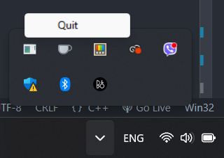

# No More Volume Key Pain

**No More Volume Key Pain** is a simple Windows app that makes adjusting your volume easier. If you’re tired of needing to press the **Fn** key just to change the volume, this app’s for you! With this little tool, you can use **F6** and **F7** to adjust volume directly—no **Fn** key needed.

## Why This App?

Honestly, this app was created out of frustration. Many keyboards make you press **Fn** along with the volume keys, which can get annoying fast if you’re frequently adjusting volume.

- `F5` - Mute/Unmute
- `F6` - Volume Down
- `F7` - Volume Up

## Stopping the App

You can easily stop the app from tray menu.



## Features

- **Volume Control**: Use **F6** to decrease and **F7** to increase the volume in easy 10% steps.
- **Overlay Display**: See your current volume level in a small overlay when you adjust it.
- **System Tray Icon**: Minimizes to the system tray with a quick right-click **Quit** option when you’re done.

## Requirements

- **Windows OS**
- **C++ Compiler** (Visual Studio, MinGW, etc.)
- **Windows SDK** (for Windows-specific APIs)
- **CMake** (for building)

## Getting Started

### Clone and Build

1. Clone the repo and go to the project folder:

    ```bash
    git clone https://github.com/yourusername/nomore_volume_key_pain.git
    cd nomore_volume_key_pain
    ```

2. Create a build folder and set up CMake:

    ```bash
    mkdir build
    cd build
    cmake -DCMAKE_BUILD_TYPE=Release ..
    ```

3. Build the project:

    ```bash
    cmake --build . --config Release
    ```

4. Run the app from the build directory:

    ```bash
    ./Release/NoMoreVolumeKeyPain.exe
    ```

### How to Use

- **Adjust Volume**: Hit **F6** to lower volume and **F7** to raise it.
- **See Volume Level**: An overlay shows you the current volume when it changes.
- **Quit**: Right-click the icon in the system tray and choose **Quit** to close the app.

## What’s Happening Under the Hood

- **Volume Control**: Uses the Windows Core Audio API to read and set the system volume.
- **Keyboard Hook**: Captures **F6** and **F7** to adjust volume, so you don’t need **Fn**.
- **Overlay Display**: Pops up briefly to show you the new volume percentage.
- **System Tray**: Gives you an easy way to exit from the tray when you’re done.

## License

This app is licensed under the MIT License, so feel free to tweak it, share it, or improve it!
